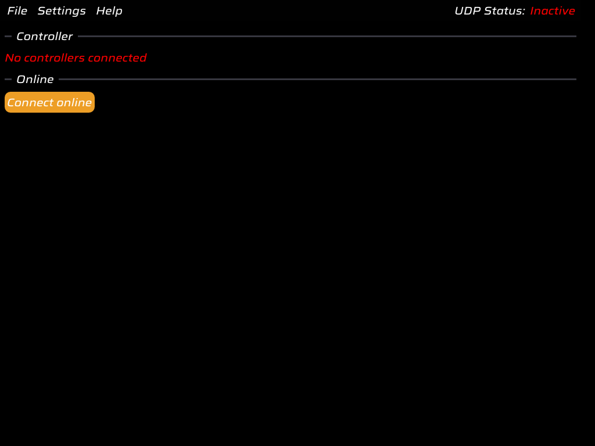

# DualSenseY

Simple and lightweight program for DualSense and DualShock 4 controllers

## About this amber fork

This fork ([khaledq84ever/DualSenseY-amber](https://github.com/khaledq84ever/DualSenseY-amber)) is a UI
reskin on top of [WujekFoliarz/DualSenseY-v2](https://github.com/WujekFoliarz/DualSenseY-v2). The whole
app's ImGui color palette is derived from one `baseColor` in `source/application.cpp`
(`Application::SetStyleAndColors`), so this fork just changes that default from the upstream purple to a
bold amber (`#C77800`) — every themed widget (buttons, sliders, frames, text) follows from it.

*Built and run headlessly on Linux (Xvfb) to confirm the theme renders correctly.*

> **Note on licensing:** upstream's in-app About dialog states "DualSenseY is licensed under the MIT
> License," but there's no `LICENSE` file in the repo root (only bundled third-party libraries under
> `thirdparty/` carry their own licenses). Treat this as source-available rather than formally
> license-cleared until upstream adds one.

## Installation

Go to [releases](https://github.com/WujekFoliarz/DualSenseY-v2/releases) and download the latest release zip, unpack and run DualSenseY.exe

    
## Features

- Controller (X360/DS4) emulation via ViGEmBus
- Audio Passthrough
- Various LED settings
- Mod support
- Adaptive trigger configurator
- Gyro support
- Touchpad diagnostics and mouse emulation
- Online controller streaming (as X360/DS4 on target computer, full gyro and touchpad support)

## Screenshots

## FAQ

#### Is this related to DSX?
No, it's a free alternative for those who need it and a hobby project.

#### How do I activate UDP?
All you need to do is run a game with dualsense mod installed, it will turn to active as soon as it receives data (If the mod asks for a port, use 6969)

## Credits
#### [Wireless haptics](https://github.com/egormanga/SAxense)

## Contact
- [Discord server](https://discord.com/invite/AFYvxf282U)
- Discord user wujek_foliarz

## [Translations](https://crowdin.com/project/dualsensey)

# Building
Windows
- Install [OpenSSL](https://slproweb.com/download/Win64OpenSSL-3_6_0.exe)
  
Linux
- Install libappindicator-gtk3
- Install openssl
